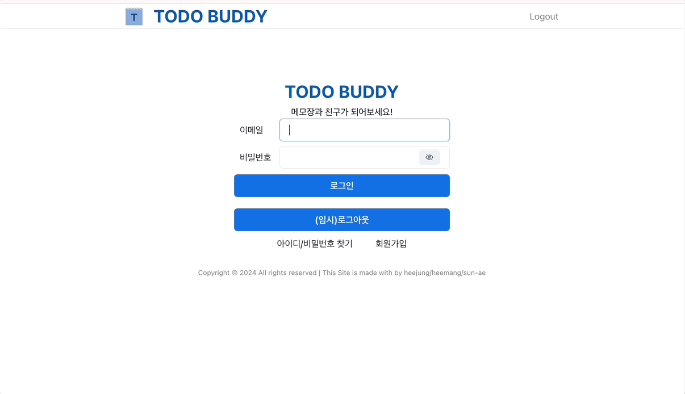

# 📝 TO-DO-LIST 서비스,  TODO BUDDY

<!-- [💻 사이트 바로가기](https://www.pastforward.link/) -->
 

 

## 프로젝트 소개

- TODO-BUDDY는 투두리스트의 주제로 새로운 메모 기록 웹사이트입니다.
- 메모의 일정 정보를 토대로 달력에 표시됩니다.
- 카테고리 설정을 통해 메모를 분류할 수 있습니다.
- 카테고리 설정 및 수정, 메모 등록, 수정 및 삭제 등의 기능이 있습니다.

 

## 팀원 구성

|                                                                 **임희정**                                                                  |                                                            **이희망**                                                            |                                                                **장선애**                                                                 |                                                                  
| :-----------------------------------------------------------------------------------------------------------------------------------------: | :------------------------------------------------------------------------------------------------------------------------------: | :---------------------------------------------------------------------------------------------------------------------------------------: | 
| [   @heejung0413](https://github.com/heejung0413) | [   @heemanglee](https://github.com/heemanglee) | [   @seonae-j](https://github.com/seonae-j)

 

## 1. 개발 환경

- Front : HTML, React, styled-Component,Chakra UI
- Back-end : 제공된 API 활용
- 협업 툴 : Discord, Notion, Github Wiki, Slack
- 디자인 : [Figma](https://www.figma.com/design/3MgLWc5qUdI3T0YYtaE81b/TODO-BUDDY?node-id=1-3&t=BfPGRD5a1jHc3ZOK-1)
   

## 2. 채택한 개발 기술

### React, Typescript

- React
  - 컴포넌트화를 통해 추후 유지보수와 재사용성을 고려했습니다.
  - 유저 배너, 상단과 하단 배너 등 중복되어 사용되는 부분이 많아 컴포넌트화를 통해 리소스 절약이 가능했습니다.
- Typescript
  - 안정적인 개발과 높은 코드 수준의 코드 품질을 유지하려면 정적 타입 문법을 추가해 개발하는 것이 편리하다 생각했습니다.
  - 변수 타입을 지정하고 javascript로 컴파일되어 실행할 수 있습니다.
  - 컴파일 과정에서 타입을 지정함으로써, 에러 예방과 손쉬운 디버깅이 가능했습니다.

### styled-components, Chakra UI

- styled-component
  - props를 이용한 조건부 스타일링을 활용하여 상황에 알맞은 스타일을 적용시킬 수 있었습니다.
  - 빌드될 때 고유한 클래스 이름이 부여되어 네이밍 컨벤션을 정하는 비용을 절약할 수 있었습니다.
  - S dot naming을 통해 일반 컴포넌트와 스타일드 컴포넌트를 쉽게 구별하도록 했습니다.
- Chakra UI
  - React 애플리케이션을 빌드하는데 필요한 블록을 간단하고 모듈적이며 접근 가능하게 만들 수 있는 UI 컴포넌트 라이브러리입니다.

### Eslint, Prettier

- 정해진 규칙에 따라 자동적으로 코드 스타일을 정리해 코드의 일관성을 유지하고자 했습니다.
- 코드 품질 관리는 eslint에, 코드 포맷팅은 prettier에 일임해 사용했습니다.
- airbnb의 코딩 컨벤션을 참고해 사용했고, 예외 규칙은 팀원들과 협의했습니다.
- 협업 시 매번 컨벤션을 신경 쓸 필요 없이 빠르게 개발하는 데에 목적을 두었습니다.

 

## 3. 역할 분담

 
    
### 👻임희정
- 프론트엔드 개발

 

### 👩🏻‍💻이희망

- 백엔드 개발

 

### 🤩 장선애

- 기획 업무

 

## 4. 개발 기간 및 작업 관리

### 개발 기간

- 전체 개발 기간 : 2024-08 ~ ING

 
